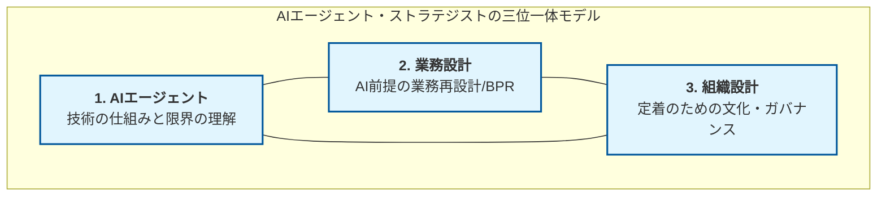
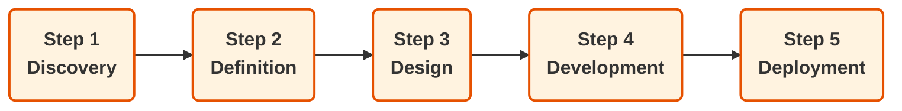

> **この章で学ぶこと**
> - AIエージェントが「ただのチャットAI」と何が違うのか
> - なぜ今、AIエージェントが注目されているのか
> - 業務でAIエージェントができること・できないこと
> - 本BookでGAS × Difyを使って何を作るのか

---

## 1-1 AIエージェントの基本

### AIエージェントとは

「AIエージェント」という言葉、最近よく聞くようになりましたよね。

でも、実際に説明しようとすると「なんとなくChatGPTの進化版？」くらいの理解で止まっている方も多いのではないでしょうか。

まずここをはっきりさせましょう。

**AIエージェントとは、「目標を与えると、自分で考えて行動を連鎖させ、結果を出してくれるAI」のことです。**

「行動を連鎖させる」というのがポイントです。たとえば、こんなイメージです：

```
目標：「今月のお問い合わせデータを分析して、Slackに週次レポートを送って」

AIエージェントがやること：
① Spreadsheetからデータを取得する
② データを集計・分類する
③ 傾向とインサイトを分析する
④ レポート文章を生成する
⑤ Slackに通知する
```

これを人間が一切介在せずに自動でやり切る。これがAIエージェントです。

### ChatGPTとの違い

「ChatGPTに同じことをお願いすればいいんじゃないの？」と思った方もいるかもしれません。

違いを一言でいえば、**「答えを返すか、行動するか」** です。

| | ChatGPT（会話AI） | AIエージェント（実行AI） |
|---|---|---|
| 入力 | テキストの質問 | 目標・タスク |
| 出力 | テキストの回答 | 実行結果（ファイル・通知・データ更新など） |
| 記憶 | 基本的に会話内のみ | タスクをまたいだ状態管理が可能 |
| ツール使用 | 限定的（プラグイン等） | 外部APIやシステムと連携 |
| 完結性 | 答えを出して終わり | アクションまで完結させる |

ChatGPTで「このレビューを分析して」とお願いすると、分析結果のテキストが返ってきます。それをコピーして、Spreadsheetに貼って、Slackに転送して…という作業は、あなた自身がやらなければいけません。

AIエージェントは、その「その後の作業」まで自分でやります。

### 「会話AI」と「実行AI」

もう少し具体的に考えてみましょう。

**会話AI（ChatGPTなど）の使い方：**

```
あなた：「このメールに返信文を作って」
AI　　：「以下の返信文はいかがでしょうか：〜〜〜」
あなた：（コピーして、メーラーに貼り付けて、送信する）
```

**実行AI（AIエージェント）の使い方：**

```
あなた：（設定済みのシステムが自動起動）
AI　　：Gmailからメールを取得 → 返信文を生成 → 下書きに保存
あなた：（下書きを確認して承認するだけ）
```

「AIに聞いて、自分で動く」から「AIが動いて、自分は確認するだけ」へ。

これが会話AIと実行AIの本質的な違いです。

---

## 1-2 なぜ今AIエージェントなのか

### 生成AIブームの変化

2022年末のChatGPT登場から、生成AIはあっという間に私たちの日常に入ってきました。

しかし少し経つと、現場では「ChatGPTに聞いてみたけど、結局自分でやり直した」「AIが出した文章をそのままは使えない」「毎回プロンプトを考えるのが面倒」という声が出てくるようになりました。

**生成AIに「期待」はしたけれど、「定着」はしなかった。**

その理由のひとつが、「AIは答えてくれるけど、動いてくれない」という構造的な問題です。

どんなに優秀な回答が返ってきても、それを使って実際に動くのは人間。AIは「優秀なアドバイザー」にはなれても、「自律的に動くスタッフ」にはなれなかった。

AIエージェントは、その壁を超えようとする技術です。

### 「AIに聞く」から「AIに任せる」へ

業務の文脈で考えると、変化のイメージはこうなります：

**フェーズ1：AIに「聞く」時代（2022〜2023年頃）**
- 「この文章を要約して」
- 「返信メールを考えて」
- 「アイデアを出して」

→ AIはアシスタント。人間がすべての「実行」を担う。

**フェーズ2：AIに「やらせる」時代（2024年〜）**
- 「お問い合わせが届いたら自動で分類して、担当者にSlack通知して」
- 「毎週月曜に先週のデータを集計してレポートを生成して」
- 「応募フォームの内容をAIでスクリーニングして結果をSpreadsheetに書き込んで」

→ AIはオペレーター。人間は「設計」と「承認」だけを担う。

この「任せる」を実現するのが、AIエージェントです。

### 業務自動化との関係

「業務自動化」というと、これまでは **RPA（Robotic Process Automation）** が主流でした。

RPAは「決まった手順を正確に繰り返す」のは得意ですが、「判断を伴う作業」は苦手です。

```
RPAが得意なこと：
→ 毎朝9時にシステムにログインして、特定ページのデータをCSVに保存する

RPAが苦手なこと：
→ メールの内容を読んで「緊急案件かどうか」を判断して、担当者を振り分ける
```

AIエージェントは、この「判断」の部分をカバーします。

| | RPA | AIエージェント |
|---|---|---|
| 得意 | ルールベースの反復作業 | 判断・分類・生成を伴う作業 |
| 苦手 | 例外処理・判断が必要な場面 | 100%の精度が求められる作業 |
| 導入難度 | やや高い（フロー設計が複雑） | 比較的低い（自然言語で指示） |
| 変化への対応 | 弱い（UI変更で壊れやすい） | 比較的強い |

RPAとAIエージェントは「競合」ではなく「補完」関係です。
単純な繰り返し作業はRPA、判断が必要な作業はAIエージェント、という使い分けが現実的です。

---

## 1-3 AIエージェントでできること

「AIエージェントで何ができるか」を整理するために、代表的な6つの機能を見ていきましょう。

本Bookの演習は、すべてこの6機能の組み合わせで成り立っています。

### ① 分類（Classification）

テキストや数値を、あらかじめ決めたカテゴリに振り分けます。

```
例：お問い合わせメールを受信したとき
→「配送に関する問い合わせ」「クレーム」「返品依頼」「その他」に自動分類
```

人間がやると1件30秒かかる分類作業が、AIなら1件1〜2秒で終わります。1日100件なら、毎日50分の削減です。

### ② 要約（Summarization）

長文を短くまとめます。単なる短縮ではなく、「何が重要か」を判断して抽出します。

```
例：長い問い合わせメールを受信したとき
→「要点：○○製品の返品を希望。購入日は△△。理由は××。」に要約
```

担当者がメールを全文読まずに、要約だけ見て対応の優先順位を判断できるようになります。

### ③ 返信生成（Response Generation）

状況に応じた返信文や文章を生成します。テンプレートとは違い、内容を踏まえた自然な文章を作れます。

```
例：お問い合わせの内容と過去の対応履歴を渡したとき
→ その案件に合わせたカスタム返信文を生成
```

「ゼロから書く」より「生成文を確認・修正する」のほうが圧倒的に速い。これが業務短縮のポイントです。

### ④ 判断（Decision Making）

条件に基づいて、「次に何をするか」を決めます。これがAIエージェントらしさの核心です。

```
例：レビューの感情分析結果を受け取ったとき
→ ネガティブ評価 かつ 星1〜2 → 「要対応」フラグを立ててアラート通知
→ ポジティブ評価 かつ 星4〜5 → 「好評」タグを付けて記録のみ
```

この「条件 → 行動」の連鎖を設計するのが、AIエージェント構築の中心的な作業です。

### ⑤ 通知（Notification）

判断結果や処理完了を、適切なチャネルに送信します。

```
例：週次レポートの生成が完了したとき
→ 担当者のSlackチャンネルにレポートを送信
→ 緊急フラグがある案件はメンション付きで通知
```

「自動でやってくれたことを、人間が知る」ための仕組みです。通知がないと、AIが頑張っても誰も気づきません。

### ⑥ レポート（Reporting）

データを集計・分析して、人間が読みやすい形式にまとめます。

```
例：1週間分のお問い合わせデータを渡したとき
→「今週の傾向：配送遅延に関する問い合わせが前週比30%増。
   特に火〜水曜に集中。原因として△△が考えられる。
   推奨アクション：□□の確認を推奨。」を生成
```

数字を見て「で、何が起きてるの？」を言語化するのは、人間にとって意外と負担です。AIはここを自動化できます。

---

### 6機能の組み合わせが「業務フロー」になる

実務では、この6機能を組み合わせてひとつの業務フローを作ります。

たとえば本Bookの「演習4：週次サマリー自動生成」はこう動きます：

```
① GASが毎週月曜に自動起動（時間トリガー）
② Spreadsheetから先週のお問い合わせデータを取得
③ GASがデータを集計（件数・カテゴリ別・曜日別など）
④ 集計データをDifyに送信
⑤ AIが傾向を分析してレポート文章を生成（要約 + 判断 + レポート）
⑥ 生成レポートをSlackに送信（通知）
```

すべて自動。月曜の朝、担当者はSlackを開くだけでレポートが届いています。

---

## 1-4 本Bookのゴール

### GAS × Difyで何を作るか

本Bookでは、GAS（Google Apps Script）とDifyを組み合わせて、実務で使えるAIエージェントを5つ作ります。

**演習1：商品レビュー感情分析システム**
ECサイトのレビューを自動分析。感情スコア・問題点・要対応判定をSpreadsheetに書き込む。

**演習2：採用応募スクリーニング**
応募フォームの内容をAIで評価。スキル抽出・スコアリング・推奨判定を自動化する。

**演習3：商品説明文ジェネレーター**
商品情報を入力するだけで、EC用の短文・長文説明文とハッシュタグを自動生成する。

**演習4：週次サマリー自動生成**
お問い合わせデータを毎週自動集計・分析して、Slackにレポートを送信する。

**演習5：多言語カスタマー対応**
多言語の問い合わせを自動で言語判定・分類・優先度付けして、返信文を生成する。

どれも「こういうの欲しかった」という実務直結のテーマです。演習を通じて、GAS × Difyの使い方だけでなく、AI業務設計の考え方も身につきます。

### なぜGAS × Difyなのか

この組み合わせを選んだ理由は、「実務に一番すぐ使えるから」です。

**GASを選ぶ理由：**
- Google Workspaceを使っている会社なら、追加コストゼロで使える
- SpreadsheetやGmailと直接連携できる
- 非エンジニアでも比較的読み書きできる

**Difyを選ぶ理由：**
- GUIでプロンプトを管理できる（コードに埋め込まなくていい）
- JSON形式で出力を固定できる（パースが安定する）
- ワークフロー機能で複雑な処理を組める
- 無料枠で始められる

「Pythonで全部書けばいいじゃないか」という意見もあります。それは正しい。でも、Pythonで書いたコードを現場の担当者が自分でメンテできるかというと、多くの場合できません。

GAS × Difyは、**「エンジニアが作って、非エンジニアが運用できる」** 構成に最適化されています。これが実務での最大の強みです。

### 本Bookが担う役割：三位一体モデル

AIを組織の力に変えるには、3本の柱を掛け合わせる必要があります。



- **AIエージェント**：本Book「GAS × Dify構築編」で技術の実装を学ぶ
- **業務設計**：演習を通じた「業務の構造化」でBPRの勘所を学ぶ
- **組織設計**：Kindle版「AI基盤設計・思想編」で、定着のためのガバナンスを学ぶ

---

### 変革を完遂するプロセス：5Dモデル

闇雲な開発を避け、確実に成果を出すための標準プロセスが「5Dモデル」です。



本Bookの演習は、Design（設計）〜 Development（実装）の領域をカバーしています。Discovery・Definition・Deploymentの領域については、Kindle版で体系的に扱っています。

---

### 実務改善の全体像

本Bookを通じて、最終的に身につけてほしいのは「AIの実装スキル」だけではありません。

```
実務AI導入で本当に大事なこと：

① 小さく始める
   → 全部を一気に自動化しようとしない
   → 1つの業務、1つの機能から始める

② 出力を固定する
   → AIに「自由に書いて」と言わない
   → JSON形式で出力を決めて、ブレをなくす

③ 運用を考える
   → 誰がメンテするのか
   → AIが間違えたとき、どう気づくか
   → ログはどこに残すか

④ 現場を巻き込む
   → 技術的に動いても、使われなければ意味がない
   → 現場の人が「これ、楽になった」と感じる設計をする
```

これらの考え方は、第2章・第4章・第10章でさらに深掘りします。

本Bookの演習を手を動かしながら進めることで、「AIで何かやりたい」というふわっとしたイメージが、「このフローをこう設計すればいい」という具体的な設計力に変わります。

では、第2章から実践に入っていきましょう。

---

> **第1章のまとめ**
>
> - AIエージェントは「答えるAI」ではなく「動くAI」
> - ChatGPTは会話AI（テキストを返す）、AIエージェントは実行AI（行動する）
> - 「AIに聞く」から「AIに任せる」へのシフトが今起きている
> - 分類・要約・返信生成・判断・通知・レポートの6機能の組み合わせが実務の基本
> - GAS × Difyは「実務に一番すぐ使える」構成
> - 本Bookでは5つの演習を通じて、AI業務設計の考え方ごと身につける

---

*次の章：第2章「なぜPoCで失敗するのか」→*
